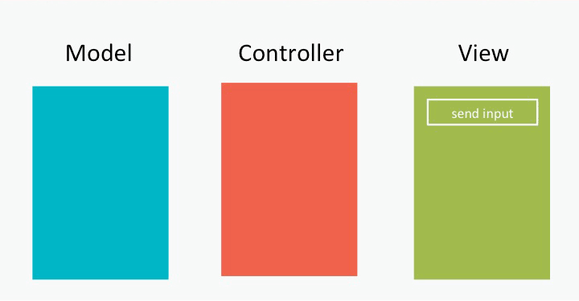
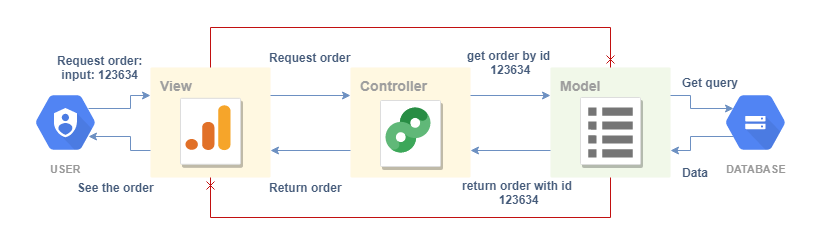

# MVC Explained 🍩

MVC or Model View Controller is a design pattern that is used in organizing and structuring applications. Since it is not fixed to a technology, programming language or company we can use this design pattern every time we build an application whether it is a web application, desktop application, mobile etc.

## What is a Design Pattern 🔹

A design pattern is not a technology. It is not some code. It is not some framework that we download. Design patterns are structured ideas or concepts that solve some problem and can be followed to solve problem of the same nature in the future. In a way they are well structured, documented and organized solutions and since they are not connected to any specific language or technology we can solve problems with them whenever we need them in whatever technology and language. MVC is an architectural design pattern meaning that it resolves issues with organization and structuring of software architecture. In simple terms, it helps us organize our folder, file and entity structure as well as their communication so that we have a better organized, readable, secure and scalable software solution. A lot of times MVC is confused with a framework, since a lot of frameworks use MVC as their main architectural pattern, but the MVC is just the idea of how to organize stuff.

## How MVC works 🔹

When building applications with the MVC design pattern in mind we want to divide our code in 3 parts. Model, View and Controller. These 3 parts communicate between each other and dictate the flow of our application. The flow goes like this:

1. User interacts with the **VIEW**
2. **VIEW** tells the controller what the user requested
3. **CONTROLLER** processes and passes the request to the **MODEL**
4. **MODEL** requests data from the database
5. **MODEL** returns data to the **CONTROLLER**
6. **CONTROLLER** updates the **VIEW**
7. The user sees the data they requested in the **VIEW**
   

### Controller

The controller is the middle man of the whole operation. The controller has 2 main responsibilities.

- Accepting requests from the view ( user interactions ), processing those requests to a suitable format and informing the model of the request
- Accepting data from the model, shaping it in a suitable response and returning the response data to the view ( result that the user sees )

This means that we need to write or call some service that does some logic in the controller in order to get or give data to the user. It is the main link that connects the user and the data, but it is also the main separator that separates the user from the main data as well. This means that the view ( where the user interacts ) never knows what is happening with the data ( the model ). This makes our data much more secure and safe and also separates the concerns of our layers in the application.

### Model

The model is basically an entity that stores data. This data is usually business logic data, some valuable data about our application. The model is connected to some data structure, usually a database and it is the only entity in the application that can communicate with the raw data on the database. The model only accepts requests and gives data back to the controller. This means that the model does not know who is requesting for the data or what is happening on the view. It only cares about fulfilling the request of the controller.

### View

View is a representation of our application that concerns the users that are using the application. The view is tasked with handling the presentation of the data to the user. The view is connected to the controller and for any data that it needs to present to the user, it calls the controller to fetch it. It does not know what kind of data structure the application is using, nor it knows how data is kept. It just asks for things and gets results from the controller.

## Why MVC is awesome 🔹

As you can imagine writing code in a huge chunk of a document is not really the best way to start building an application. Neither does writing multiple files in one huge folder. This is bad because as the application grows it becomes harder to find and change things, when one part of the code is changed, everything must be changed as well and it is less secure because the code that the user has contact with is in direct contact with the real data of our application. All of this amounts to a REALLY SLOW development process and REALLY SAD developers. The MVC design pattern solves a lot of these issues by:

- Organizing the code making it easy to get around
- Structure the code so that we don't duplicate code
- Separate concerns so that we can easily change things without affecting the whole application
- Separate the user and the data so that users do not have direct contact with our data
- Scale and develop our application faster and safer

## Extra Materials 📘

- [MVC simplified](https://www.guru99.com/mvc-tutorial.html)
- [MVC explained as a sandwich shop](https://www.freecodecamp.org/news/simplified-explanation-to-mvc-5d307796df30/)
- [Cool MVC video](https://www.youtube.com/watch?v=1IsL6g2ixak)
